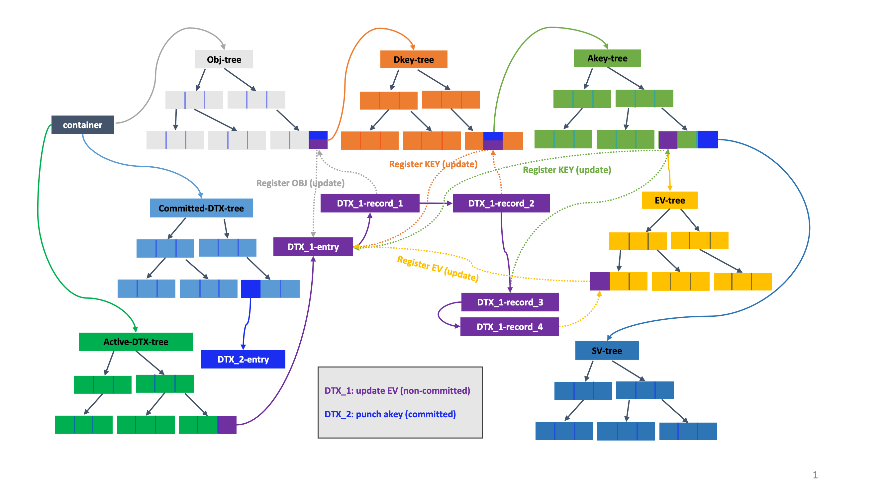

# VOS(版本控制对象库)

## 基于持久性内存的存储

DAOS服务具有两层存储：
~~~~
- 用于字节粒度的应用程序数据和元数据的SCM
- 用于批量应用程序数据的NVMe
~~~~

当前的DAOS存储模型涉及每个内核三个DAOS服务器xstream，以及一个映射到NVMe的主要DAOS服务器xstream。DAOS的存储分配可以通过PMDK pmemobj池在SCM上进行分配，也可以用过SPDK Bloib在NVMe上进行分配。

## VOS概念

版本控制对象库通过将VOS池（vpool）`初始化为DAOS池的一个分片，来提供存储目标本地的对象存储`。一个vpool可以为称为容器的多个对象地址空间保存对象。每个vpool在创建时都会获得一个唯一的UID，该ID与DAOS池的UID不同。VOS还维护并提供了一种提取统计信息的方法，例如总空间，可用空间和虚拟池中存在的对象数。

VOS的主要目的是按任意时间顺序捕获和记录对象更新，并将它们集成到可以按需有效遍历的有序纪元历史记录中。通过正确地对冲突的更新进行排序，而不需要对其进行及时序列化，这为并行I / O提供了重大的可伸缩性改进。`例如，如果两个应用程序进程就如何解决给定更新中的冲突达成协议，则它们可以独立编写更新，并确保将在VOS上以正确的顺序解决它们`。

VOS还允许丢弃与给定纪元和过程组关联的所有对象更新。此功能可确保当必须中止DAOS事务时，在为该进程组提交时期并将其变为不可变之前，所有关联的更新都是不可见的。这确保了分布式更新是原子的-即，当提交完成时，所有更新都已应用或被丢弃。

最后，VOS可以汇总对象的时代历史，以回收不可访问的数据使用的空间，并通过简化索引来加快访问速度。例如，当在给定的纪元中将数组对象从0“打孔”到无穷远时，一旦关闭容器，在该纪元之前的最新快照之后更新的所有数据将变得不可访问。

在内部，VOS维护容器UUID的索引，该索引引用存储在特定池中的每个容器。容器本身包含三个索引。第一个是对象索引，用于在服务I / O请求时将对象ID和纪元有效地映射到对象元数据。其他两个索引用于维护活动和已提交的DTX记录，以确保跨多个副本进行有效的更新。

DAOS支持两种类型的值，每种类型都与分发键（DKEY）和属性键（AKEY）相关联：单个值和数组值。DKEY用于放置，确定使用哪个VOS池存储数据。AKEY标识要存储的数据。同时指定DKEY和AKEY的能力为应用程序提供了在DAOS中分发或共置不同值的灵活性。单个值是一个原子值，意味着将其写入AKEY会更新整个值，而读取会整体读取最新的值。数组值是大小相等的记录的索引。对数组值的每次更新仅影响指定的记录，并读取对请求的每个记录索引的最新更新。每个VOS池都维护VOS提供的每个容器层次结构，包括容器，对象，DKEY，AKEY，下面。DAOS API提供了在此基础接口上构建的通用键值和数组抽象。前者将DKEY设置为用户指定的密钥，并使用固定的AKEY。后者使用数组索引的高位来创建DKEY，并使用固定的AKEY，从而在对象布局中的所有VOS池上平均分配数组索引。对于VOS的其余描述，应使用键值和键数组来描述VOS布局，而不是使用这些简化的抽象。换句话说，它们将在单个VOS池中描述DKEY-AKEY-Value。

VOS对象不是显式创建的，而是在第一次写入时通过创建对象元数据并将其引用插入拥有容器的对象索引中而创建的。所有对象更新都会记录每次更新的数据，可以是对象，DKEY，AKEY，单个值或数组值打孔或单个值或数组值的更新。请注意，将数组对象范围的“打孔”记录为归零范围，而不是导致丢弃相关的数组范围或键值。记录了对象，DKEY，AKEY或单个值的输入，因此在以后的时间戳读取时看不到任何数据。这确保了对象的完整版本历史记录仍可访问。但是，DAOS api只允许访问快照中的数据，因此VOS聚合可以主动删除对象，密钥，


DAOS api只允许访问snapshot中的数据。

<a id="7a"></a>


## VOS 索引

对象索引表的值（由OID索引）指向DKEY索引。由DKEY索引的DKEY索引中的值指向AKEY索引。由AKEY索引的AKEY索引中的值指向单值索引或数组索引。纪元引用单个值索引，该索引将返回在纪元或纪元之前插入的最新值。数组值由范围和时期索引，并将返回在该时期可见的范围的部分。

关于对象期望的提示可以编码在对象ID中。例如，对象可以被复制，擦除编码，使用校验和，或者具有整数或词法DKEY和/或AKEY。如果使用整数或词法键，则对象索引按键排序，从而使查询（例如数组大小）更加有效。否则，键由索引中的哈希值排序。对象ID是128位。高32位用于对对象类型和键类型进行编码，而低96位是用户定义的标识符，该标识符对于容器必须是唯一的。

每个对象，dkey和akey都有关联的化身日志。化身日志可以描述为关联实体的创建和冲压事件的有序日志。在该值的路径中检查每个实体的日志，以确保该实体及其值在请求的时间可见。

## Key Value Stores（Single Value）

VOS在持久性内存上提供了一个多版本的并发KV存储，该存储可以动态增长并提供快速的近周期检索和键值枚举。

VOS必须能够在任何时期接受KV对的插入，并且必须能够为任何键值对象上的并发更新和查找提供良好的可伸缩性。KV对象还必须能够支持任何类型和大小的键和值。

### 键值存储支持的操作

VOS支持四种类型的操作，更新、查找、打孔以及枚举。

更新和打孔操作将新密钥添加到KV存储或记录现有密钥的新值。Punch记录特殊值“ punched”（实际上是一个负数），以记录删除键时的纪元。不允许共享同一时期用于同一对象，键，值或范围的更新和操作，并且尝试共享时，VOS将返回错误。

查找`遍历KV元数据`以确定给定纪元处给定键的状态。如果根本找不到该密钥，则返回“未命中”以指示此VOS中缺少该密钥。否则，返回小于或等于请求的时期的接近时期或最大时期的值。如果这是特殊的“打孔”值，则表示密钥已在请求的纪元中删除。此处的值是指内部树数据结构中的值。KV对象的键值记录作为其节点的值存储在树中。因此，在打孔的情况下，该值包含“特殊”返回码/标志，以标识打孔操作。

VOS还支持枚举属于特定时期的密钥

###VOS KV Srore中的key

VOS KV支持从小键到超大键的键大小。对于AKEY和DKEY，VOS支持散列键或两种“直接”键之一：词汇或整数。

#### 散列键

最灵活的密钥类型是散列密钥。VOS在用户提供的键上运行两种快速哈希算法，并将合并的哈希键值用于索引。组合哈希的目的是避免密钥之间的冲突。仍然必须对实际密钥进行比较以确保正确性。

#### 直接键

使用散列键会导致无序键。在用户的算法可能受益于订购的情况下，这是有问题的。因此，VOS支持两种类型的密钥，这些密钥不是散列的而是直接解释的。

##### 词汇键（Lexical Keys）

使用词法顺序比较词法键。这样可以启用诸如排序字符串之类的用法。当前，词法键的长度受到限制，但是最多为80个字符

##### 整数键

整数键是无符号的64位整数，因此进行了比较。这样就可以实现诸如用索引的高位作为dkey和低位作为偏移量的DAOS数组API之类的用例。这使此类对象可以使用DAOS密钥查询API来更有效地计算大小。

VOS中的KV存储库允许用户以随机顺序维护不同KV对的版本。例如，更新可以发生在epoch 10，然后是在epoch 5的另一次更新（HCE小于5）。为了提供这种灵活性，KV存储中的每个密钥都必须保持更新/打孔的epoch以及钥匙。索引树中条目的排序首先基于键，然后基于历元。这种排序方式使相同密钥的历元可以落在相同的子树中，从而最大程度地降低了搜索成本。使用稍后描述的DTX执行冲突解决和跟踪。DTX确保副本一致，并且失败或未提交的更新在外部不可见。

### 内部数据结构

设计VOS KV存储需要树形数据结构，该数据结构可以动态增长并保持自我平衡。需要平衡树以确保时间复杂度不会随着树大小的增加而增加。所考虑的树数据结构是红黑树和B +树，前者是二进制搜索树，而后者是n元搜索树。

尽管与AVL树相比，红黑树提供的刚性平衡程度较低，但它们通过具有更便宜的重新平衡成本来补偿。红黑树在示例中被更广泛地使用，例如Linux内核，java-util库和C ++标准模板库。B +树与B树的不同之处在于它们没有与其内部节点关联的数据。这可以促进在内存页面上安装更多键。另外，B +树的叶节点是链接的；这意味着进行完整扫描将只需要线性遍历所有叶节点，与B树相比，可以潜在地最大程度地减少缓存未命中以访问数据。

为了支持上一节中提到的更新和打孔（键值存储支持的操作），为每个更新或打孔请求设置了一个时期有效范围以及相关的密钥，该范围将密钥标记为从当前时期到最高可能时期都是有效的。在将来的某个纪元或过去的纪元上更新到相同的密钥会相应地修改先前更新或穿孔的结束纪元有效性。这样，只有一个密钥对任何给定的密钥-历元对查找都具有有效范围，同时记录了密钥更新的整个历史记录。这有助于最近时期搜索。打孔和更新都具有相似的键，只是一个简单的标志标识了查询纪元上的操作。`查找必须能够在给定的纪元中搜索给定的键并返回关联的值`。除了时代有效范围外，由DAOS生成的容器句柄cookie也与树的密钥一起存储。

下表列出了一个用于创建KV商店的简单示例输入。下表和图中分别显示了基于B +树的索引和基于红黑树的索引。为了便于说明，示例中使用了代表性的键和值。

用于更新/打孔的实例VOS KV商店输入

|Key|Value|Epoch|Update (U/P)|
|---|---|---|---|
|Key 1|Value 1|1|U|
|Key 2|Value 2|2|U|
|Key 3|Value 3|4|U|
|Key 4|Value 4|1|U|
|Key 1|NIL|2|P|
|Key 2|Value 5|4|U|
|Key 3|Value 6|1|U|

<a id="7d"></a>


在下表中，n是树中的条目数，m是键的数量，k是键的数量，两个唯一键之间的历元条目。

|Operation|Red-black tree|B+Tree|
|---|---|---|
|Update|O(log2n)|O(log<sub>b</sub>n)|
|Lookup|O(log2n)|O(log<sub>b</sub>n)|
|Delete|O(log2n)|O(log<sub>b</sub>n)|
|Enumeration|O(m* log<sub>2</sub>(n) + log<sub>2</sub>(n))|O(m * k + log<sub>b</sub> (n))|


尽管这两种解决方案都是可行的实现，但是确定理想的数据结构将取决于这些数据结构在持久性存储硬件上的性能。

VOS还支持对这些结构的并发访问，这要求在存在并发更新时，选择的数据结构可提供良好的可伸缩性。与B +树相比，红黑树中的重新平衡会导致更具侵入性的树结构变化；因此，B +树可以通过并发访问提供更好的性能。此外，由于B +树节点包含许多插槽，具体取决于每个节点的大小，因此在缓存中进行预取可能会更容易。此外，上表中的顺序计算复杂性表明，与红黑树相比，具有合理顺序的基于B +树的KV存储可以执行得更好。

VOS支持枚举在给定时期内有效的密钥。VOS提供了一种基于迭代器的方法，可从KV对象提取所有键和值。首先，KV索引按键排序，然后按时期排序。由于每个密钥都有很长的更新历史，因此树的大小可能很大。使用树后继方法进行枚举可能会导致红黑树的O（m * log（n）+ log（n））渐近复杂度，其中m是在请求的时期内有效的键数。O（log2（n））定位树中的第一个元素，O（log2（n））定位后继元素。因为需要检索“ m”个键，所以O（m * log2（n））将是此枚举的复杂度。

在B +树的情况下，叶节点是按升序排列的，枚举将是直接解析叶节点。复杂度为O（m * k + logbn），其中m是在一个纪元中有效的密钥数，k是B +树叶节点中两个不同密钥之间的条目数，b是B +的顺序树。在两个不同的密钥之间具有“ k”个历元条目会导致O（m * k）的复杂性。需要额外的O（logbn）来定位树中的第一个最左键。上图所示的通用迭代器接口也将用于KV枚举。

除了枚举某个时期中有效对象的键外，VOS还支持枚举在两个时期之间修改的对象的键。纪元索引表提供在每个纪元中更新的密钥。在汇总与每个时期关联的密钥列表时（通过保留密钥的最新更新并丢弃较旧的版本），VOS可以生成具有其最新时期的密钥列表。通过从列表中的关联索引数据结构中查找每个键，VOS可以使用基于迭代器的方法来提取值。

## Key Array Stores

VOS支持的第二种对象是键数组对象。与KV存储类似，数组对象允许多个版本，并且必须能够同时写入，读取和打孔字节范围范围的任何部分。<a href="#7f">下图</a>显示了键数组对象内范围和历元排列的简单示例。在此示例中，不同的行表示存储在各个扩展区中的实际数据，并且颜色编码指向写入该扩展区范围的不同线程。

<a id="7f"></a>

<b>Example of extents and epochs in a Key Array object</b>


在上面的示例中，不同范围范围之间存在明显的重叠。VOS支持最近时间访问，这需要读取任何给定范围范围内的最新值。例如，在上图中，如果在时代10有对扩展范围4-10的读取请求，则生成的读取缓冲区应包含从时代9开始的扩展区7-10，从时代8开始的扩展区5-7，以及扩展区4。从时代1开始5。VOS阵列对象还支持部分和完整范围范围内的打孔。

<b>Example Input for Extent Epoch Table</b>

|Extent Range|Epoch |Write (or) Punch|
|---|---|---|
|0 - 100|1|Write|
|300 - 400|2|Write
|400 - 500|3|Write|
|30 - 60|10|Punch|
|500 - 600|8|Write|
|600 - 700|9|Write|

R树提供了一种合理的方式来表示范围和时期有效性范围，从而限制了处理读取请求所需的搜索空间。VOS提供了一个专门的R树，称为范围有效性树（EV-Tree），用于存储和查询版本化的数组索引。在传统的R-Tree实现中，矩形是有界且不可变的。在VOS中，“矩形”由一个轴上的范围范围和另一轴上的历元有效范围组成。但是，时代有效性范围在插入时是未知的，因此，所有矩形均以无穷大的上限插入。最初，DAOS设计要求在插入时拆分此类树中矩形以限制有效范围，但是一些因素导致决定保留原始有效范围。第一的，持久性存储器的更新比查找要贵一个数量级。其次，可以通过聚合删除快照之间的覆盖，从而在重叠写入方面保持相当小的历史记录。这样，EV-Tree在提取时实现了两部分算法。

- 找到所有重叠的范围。这将包括在请求的时期之前发生的所有写入，即使它们被后续写入覆盖。
- 按范围开始然后按纪元排序
- 遍历已排序的数组，必要时拆分范围，并在适用时将其标记为可见
- 重新排序数组。根据使用情况，最终的排序可以选择保留或丢弃漏洞和覆盖范围。

TODO: Create a new figure
<a id="7k"></a>
<b>Rectangles representing extent_range.epoch_validity arranged in 2-D space for an order-4 EV-Tree using input in the table <a href="#7g">above</a></b>


图中下面在先前与EV-树的分割和修整操作构造为例如矩形显示表引入到考虑广泛分裂的情况下-与附加写入在偏移量{100 0}。图中上面示出了EV-树结构对于相同的例子。


通过检查是否有重叠，EV树中的插入可找到要插入的适当叶节点。如果多个边界框（bounding boxes）重叠，则选择扩大最小的边界框。通过选择面积最小的边界框可以解决其他关系。每个插入的最大成本可以为O (log<sub>b</sub>n)。

除上述错误重叠问题外，搜索EV-Tree的工作方式与R-Tree类似。必须追求所有重叠的内部节点，直到有匹配的内部节点和叶子为止。由于范围范围可以跨越多个矩形​​，因此一次搜索可以命中多个矩形。在理想情况下（整个范围范围位于一个矩形上），读取成本为O（log b n），其中b是树的顺序。排序和拆分阶段会增加O（n log n）的额外开销，其中n是匹配范围的数量。在最坏的情况下，这等效于树中的所有扩展区，但这可以通过聚合得到缓解，并且可以预期与单个键的单个分片关联的树将相对较小。

为了从EV-Tree中删除节点，可以使用与搜索相同的方法来定位节点，并且可以删除节点/插槽。删除后，要合并具有少于order/2条目的多个叶节点，则需要重新插入。进行EV树重新插入（而不是像B +树中那样合并叶节点）是因为在删除叶节点/插槽时，边界框的大小会发生变化，并且确保将矩形组织成最小边界框而不将其组织很重要。不必要的重叠。在VOS中，仅在聚合和丢弃操作期间才需要删除。这些操作将在下一节（基于纪元的操作）中进行讨论。

## 条件更新和MVCC
VOS支持对单个dkey和akey的条件操作。支持一下操作：
- 有条件的获取：如果键存在，则获取，否则以-DER_NONEXIST失败
- 有条件的更新：如果键存在，则更新，否则以-DER_NONEXIST失败
- 有条件的插入：如果键不存在，则更新，否则以-DER_EXIST失败
- 有条件的打孔：如果键存在，则打孔，否则以-DER_NONEXIST失败

这些操作提供了原子操作，可以启用某些需要这种操作的用例。有条件的操作是使用存在检查和读取时间戳的组合来实现的。读取时间戳使有限的MVCC能够防止读取/写入竞争，并提供可串行性保证。

### VOS时间戳缓冲

VOS维护读取和写入时间戳的内存缓存，以强制执行MVCC语义。时间戳缓存本身包括两部分：

1. Negative entry cache. 对于每种类型的实体（包括对象，dkey和akey），每个target都有一个全局数组。每个级别的索引由父实体的索引（在容器的情况下为0）和相关实体的哈希值的组合确定
如果两个不同的键映射到相同的索引，则它们共享时间戳条目。只要可以取得进展，这将导致一些错
的冲突，但不会影响正确性。该数组的目的是为VOS树中不存在的条目存储时间戳。创建条目后，它
使用下面的＃2中描述的机制。请注意，同一目标中的多个池使用此共享缓存，因此在存在实体之前
也有可能在各个池之间发生错误冲突。这些条目在启动时使用启动服务器的全局时间进行初始化。这样
可以确保在更早的时间强制进行任何更新，以确保我们保持自主性，因为当服务器关闭时时间戳数据会
丢失。
2. Positive entry cache.每个目标的LRU缓存，用于现有容器，对象，dkey和akey。每个级别使
用一个LRU阵列，以便容器，对象，dkey和akey仅与相同类型的缓存条目冲突。当将现有项目从缓存中
逐出时，某些精度会丢失，因为这些值将与上面＃1中描述的对应否定条目合并，直到将条目带回到缓
存中为止。缓存条目的索引存储在VOS树中，尽管它仅在运行时有效。在服务器重新启动时，重新启动
发生时LRU缓存将从全局时间开始初始化，并且所有条目都会自动失效。将新条目放入LRU时，将使用
相应的否定条目对其进行初始化。

### 读取时间戳

时间戳缓存中的每个条目都包含两个读取时间戳，以便为DAOS操作提供可序列化性保证。这些时间戳是
1. 较低的时间戳（entity.low）表示已从entity.low读取了以该实体为根的子树中的所有节点。
2. 高时间戳（entity.low）表示已从entity.high读取了以该实体为根的子树中的至少一个节点。

对于任何叶节点（即akey），低==高；对于任何的非叶节点，低<=高。

用法如下：

### 写时间戳

为了检测epoch不确定性违规，VOS还为每个容器，对象，dkey和akey维护一对写入时间戳。从逻辑上讲，时间戳表示对实体本身或对子树中实体的最新两次更新。至少需要两个时间戳才能避免在以后有任何更新时假设不确定性。该图 下面显示了至少需要两个时间戳。仅使用单个时间戳，第一，第二和第三种情况将无法区分，并且由于不确定而将被拒绝。在所有情况下都使用最准确的写入时间戳。例如，如果访问是数组提取，则在没有确定的键或对象不确定冲击的情况下，我们将检查冲突的范围。

**方案说明写入时间戳缓存的实用程序**


### MVCC 规则

每个DAOS I / O操作都属于一个事务。如果用户不将操作与事务相关联，则DAOS将该操作视为单操作事务。因此，如上所述的条件更新被视为包括条件检查的事务，如果检查通过，则进行更新或打孔操作。

每个事务都有一个epoch。单操作事务和条件更新从其访问的冗余组服务器获取其时期，快照读取事务从快照记录获取其时期，而其他所有事务从其访问的第一台服务器的HLC获取其时期。（在较早的情况下，较早的实现使用客户端HLC选择时期。为了放宽对客户端的时钟同步要求，后来的实现已转向使用服务器HLC选择时期，同时引入了客户端HLC跟踪器来跟踪客户端听到的最高服务器HLC时间戳。事务使用其纪元执行所有操作。

MVCC规则可确保事务执行，就好像它们按照其epoch顺序进行了序列化，同时符合外部一致性一样，只要系统时钟偏移始终在预期的最大系统时钟偏移（ε）之内即可。为了方便起见，这些规则将I / O操作分为读和写：

  - Reads
      - Fetch akeys [akey level]
      - Check object emptiness [object level]
      - Check dkey emptiness [dkey level]
      - Check akey emptiness [akey level]
      - List objects under container [container level]
      - List dkeys under object [object level]
      - List akeys under dkey [dkey level]
      - List recx under akey [akey level]
      - Query min/max dkeys under object [object level]
      - Query min/max akeys under dkey [dkey level]
      - Query min/max recx under akey [akey level]
  - Writes
      - Update akeys [akey level]
      - Punch akeys [akey level]
      - Punch dkey [dkey level]
      - Punch object [object level]

每次读或写都处于四个级别之一：容器，对象，dkey和akey。一项操作被视为对以其级别为根的整个子树的访问。尽管这会引入一些错误的冲突（例如，列表操作与不会更改列表结果的较低级别的更新），但该假设简化了规则。

在epoch为e处的读取遵循以下规则：

    // Epoch uncertainty check
    if e is uncertain
        if there is any overlapping, unaborted write in (e, e_orig + epsilon]
            reject

    find the highest overlapping, unaborted write in [0, e]
    if the write is not committed
        wait for the write to commit or abort
        if aborted
            retry the find skipping this write

    // Read timestamp update
    for level i from container to the read's level lv
        update i.high
    update lv.low 

在纪元e的写入遵循以下规则：

    // Epoch uncertainty check
    if e is uncertain
        if there is any overlapping, unaborted write in (e, e_orig + epsilon]
            reject

    // Read timestamp check
    for level i from container to one level above the write
        if (i.low > e) || ((i.low == e) && (other reader @ i.low))
            reject
    if (i.high > e) || ((i.high == e) && (other reader @ i.high))
        reject

    find if there is any overlapping write at e
    if found and from a different transaction
        reject
涉及读和写的事务必须遵循两组规则。作为优化，单读取事务和快照（读取）事务不需要更新读取时间戳。但是，快照创建必须更新读取的时间戳，就像它是读取整个容器的事务一样。

当交易被拒绝时，它将以相同的交易ID重新开始，但时长更高。如果该时期变得高于原始时期加上ε，则该时期变得确定，从而保证了由于该时期不确定性检查而导致的重新启动。

交易之间的僵局是不可能的。仅当t_2需要等待t_1的写入提交时，具有时期e_1的事务t_1才可以阻止具有时代e_2的事务t_2。由于使用了客户端缓存，因此t_1必须正在提交，而t_2可能正在读取或提交。如果t_2正在读取，则e_1 <= e_2。如果t_2正在提交，则e_1 < e_2。假设有一个达到死锁的交易周期。如果周期包括承诺边缘，那么沿周期的历元必须先增大然后减小，从而引起矛盾。如果所有边缘都在提交读取，那么必须同时存在两个这样的边缘，从而导致读取事务无法阻止其他事务的矛盾。因此，无需担心死锁。

如果实体以不断增加的时期来获取读取，则由于该实体的读取时间戳不断增加，对该实体的写入可能会继续被拒绝。在daos_tx_restart调用期间引入了带有随机化的指数补偿（请参阅d_backoff_seq）。这些对于dfs_move工作负载（读者也可以在其中写）有效。

### Punch 传播
由于条件操作依赖于空语义，因此VOS读取操作（尤其是列表）可能非常昂贵，因为它们可能需要读取子树以查看实体是否为空。为了解决此问题，VOS改为进行打孔传播。在打孔操作中，将读取父树以查看打孔是否导致其为空。如果是这样，则父树也会被打孔。当前，传播在dkey级别停止，这意味着该对象将不会被打孔。打孔传播仅适用于打孔键，不适用于值。

## Epoch Based Operations

纪元提供了一种在不破坏更新/写入历史的情况下修改VOS对象的方法。每次更新都会占用内存，丢弃未使用的历史记录可帮助回收未使用的空间。VOS提供了压缩写入/更新历史记录和回收每个存储节点中的空间的方法。如果事务中止，VOS还支持回滚历史记录。DAOS API时间戳对应于VOS纪元。该API仅允许读取最新状态或从持久快照中读取，这只是给定纪元的引用。

为了压缩时期，VOS允许快照之间的所有时期进行汇总，即，任何密钥的最新时期的值/范围数据始终保留在较旧的时期上。这也确保了合并历史记录不会导致丢失对纪元的排他性更新/写入。为了回滚历史记录，VOS提供了丢弃操作。

```C
int vos_aggregate(daos_handle_t coh, daos_epoch_range_t *epr);
int vos_discard(daos_handle_t coh, daos_epoch_range_t *epr);
int vos_epoch_flush(daos_handle_t coh, daos_epoch_t epoch);
```
VOS中的聚合和丢弃操作接受通常要与持久快照之间的范围相对应的一系列epoch进行聚合。

### VOS Discard

舍弃会强行删除纪元，而不会造成聚合。仅当需要删除与值/范围数据关联的pair时，才需要执行此操作。在此操作期间，VOS从cookie索引表中查找与请求的时间段范围内的每个cookie相关的所有对象，并通过查看它们各自的时间段有效性直接从相应的对象树中删除记录。DAOS需要丢弃以服务中止请求。中止操作需要丢弃才能同步。

在丢弃期间，需要在键和字节数组矩形中搜索其末期为（discard_epoch-1）的节点/插槽。这意味着在现在丢弃的纪元之前有一个更新，并且修改了其有效性以支持近纪查询。必须将先前更新的该时期有效性扩展到无穷大，以确保将来在近时期进行的查找将获取键/范围的最新已知更新值。

### VOS Aggregate

在聚合期间，VOS必须保留对关键/扩展范围的最新更新，并丢弃其他更新和在持久快照上可见的所有更新。VOS可以自由地删除或合并key或扩展范围，只要它不会改变在最新时间戳或任何持久快照时期可见的视图。聚合利用vos_iterate API在持久快照之间查找可见条目和隐藏条目，并删除隐藏键和扩展数据块，并合并连续的部分扩展数据块以减少元数据开销。聚合可能是一项昂贵的操作，但不需要消耗关键路径上的周期。特殊的聚合ULT处理聚合，经常产生以避免阻塞连续的I / O。


## VOS Checksum Management

VOS负责在对象更新期间存储校验和，并在提取对象时检索校验和。校验和将与其他VOS元数据一起存储在SCM中。对于单值类型，将存储一个校验和。对于数组值类型，可以基于块大小存储多个校验和。

块大小被定义为数据的校验和源自的字节的最大数目。扩展区是根据记录定义的，而块大小是根据字节定义的。在计算扩展范围所需的校验和数时，需要记录数和记录大小。校验和通常应从块大小字节派生，但是，如果范围小于块大小或范围不是“块对齐”，则校验和可能从小于块大小的字节派生。

该短语对齐将有绝对的偏移，而不是一个I / O偏移。因此，即使一个范围恰好等于或小于“块大小”字节长，但如果它越过对齐障碍，它也可能具有多个“块”。

### Configuration
创建容器时，将为容器配置校验和。校验和特定的属性可以包含在daos_cont_create API中。此配置尚未完全实现，但是属性可能包括校验和类型，块大小和服务器端验证。

### Storage

校验和将分别存储在单个值类型和数组值类型的记录（vos_irec_df）或扩展区（evt_desc）结构中。由于校验和可以是可变大小的，因此取决于配置的校验和的类型，校验和本身将附加到结构的末尾。在为SCM上的持久性结构分配内存时，将包括校验和所需的大小（vos_reserve_single / vos_reserve_recx）。

下图说明了VOS的总体布局以及校验和的存储位置。请注意，校验和类型实际上尚未存储在vos_cont_df中。


### Checksum VOS Flow (vos_obj_update/vos_obj_fetch)

更新时，校验和是I / O描述符的一部分。然后，在akey_update_single / akey_update_recx中，校验和缓冲区指针包含在用于树更新的内部结构中（对于SV是vos_rec_bundle，对于EV是evt_entry_in）。如已经提到的，分配的持久性结构的大小包括校验和的大小。最后，在存储记录（svt_rec_store）或范围（evt_insert）的同时，将校验和复制到持久性结构的末尾。

在获取时，更新流程实质上是相反的。

作为参考，流程中的关键交汇点是：

 - SV Update: 	vos_update_end 	-> akey_update_single 	-> svt_rec_store
 - Sv Fetch: 	vos_fetch_begin -> akey_fetch_single 	-> svt_rec_load
 - EV Update: 	vos_update_end 	-> akey_update_recx 	-> evt_insert
 - EV Fetch: 	vos_fetch_begin -> akey_fetch_recx 	-> evt_fill_entry

## 元数据开销

There is a tool available to estimate the metadata overhead. It is described on the <a href="https://github.com/daos-stack/daos/blob/master/src/client/storage_estimator/README.md">storage estimator</a> section.

## 副本一致性

DAOS支持多个副本以实现数据高可用性。当目标在对复制的对象进行更新期间失败并且将并发更新以不一致的顺序应用于复制的目标时，副本之间可能会出现不一致。

解决不一致问题的最直观的解决方案是分布式锁定（DLM），它由某些分布式系统（例如Lustre）使用。对于DAOS，具有强大的下一代硬件的用户空间系统，在多个独立的应用程序空间之间维护分布式锁，将带来不可接受的开销和复杂性。相反，DAOS使用优化的两阶段提交事务来确保副本之间的一致性。

### DAOS两阶段提交（DTX）

当应用程序要修改（更新或打孔）具有多个副本的对象时，客户端会将修改后的RPC发送到领导副本（通过 下文讨论的DTX领导选举算法）。领导者将RPC分派给其他副本，每个副本并行进行修改。批量传输不由领导者转发，而是直接从客户端传输，从而通过利用完整的客户端-服务器带宽来改善负载平衡并减少延迟。

在进行修改之前，将使用客户端选择的DTX标识符在每个副本上启动本地事务（称为“ DTX”），该标识符对于容器内的当前RPC是唯一的。DTX中的所有修改都记录在DTX事务表中，并且对该表的向后引用保留在每个修改的记录中。完成本地修改后，每个非领导副本都将DTX状态标记为“已准备好”，并回复领导副本。领导者在完成修改并已收到所有副本的成功回复后，立即将DTX状态设置为“可提交”。如果任何副本无法执行修改，它将以失败的方式答复领导者，领导者将要求其余副本“中止” DTX。一旦领导者将DTX设置为“可提交”

客户可以在收到领导者的成功答复后立即认为修改已完成，无论DTX是否实际“已提交”。当“可提交的” DTX计数超过某个阈值或由于与后续修改的潜在冲突而通过分派的RPC附带时，领导者副本负责异步提交“可提交的” DTX。

当应用程序要从具有多个副本的对象中读取内容时，客户端可以将RPC发送到任何副本。在服务器端，如果相关的DTX已提交或可提交，则可以将记录返回到该位置。如果已准备好DTX状态，并且副本不是领导者，它将回复客户端，告诉客户端将RPC发送给领导者。如果它是领导者并且处于“已提交”或“可提交”以外的任何状态，则该条目将被忽略，并且最新的已提交修改将返回给客户端。

DTX模型内置在DAOS容器中。每个容器都维护自己的DTX表，该表在SCM中被组织为两个B +树：一个用于活动DTX，另一个用于提交的DTX。下图表示在DTX模型下对复制对象的修改。

<b>在DTX模型下修改多个复制的对象</b>




### DTX领袖选举

在DTX模型中，领导者是一个特殊的副本，它比其他副本做更多的工作，包括：

所有修改RPC都发送给领导者。领导者在将修改分发到其他副本之前执行必要的健全性检查。

非领导者副本告诉客户端将处于“准备” DTX状态的读取重定向到领导者副本。因此，领导者可能比非领导者承受更大的读取负载。

为了避免一般的负载不平衡，请遵循以下一般准则为每个对象或dkey进行引线选择：

R1：当不同的复制对象共享相同的冗余组时，不应将相同的领导者用于每个对象。

R2：当具有多个DKEY的复制对象跨越多个冗余组时，不同冗余组中的引导者应位于不同的服务器上。

R3：在领导者选择中应避免频繁失败的服务器，以避免频繁的领导者迁移。